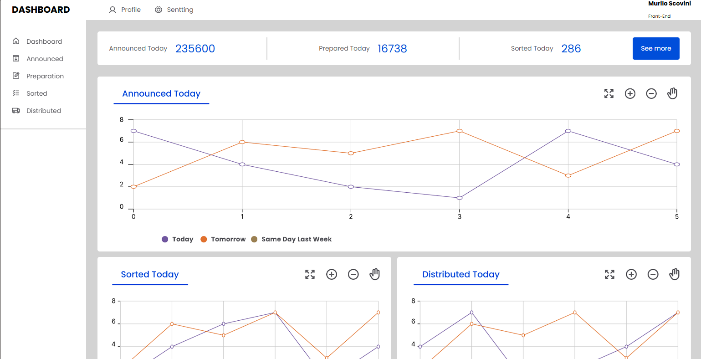
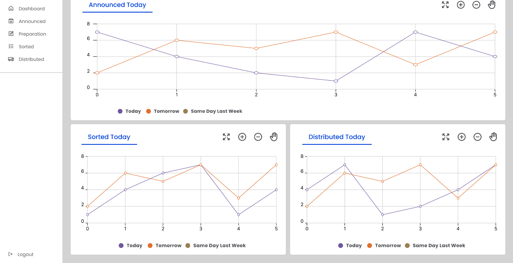

# Projeto Dashboard

### 📝 Descrição

Projeto desenvolvido com o intuito de simular uma dashboard de uma empresa ficcia. Focado em desenvolver e aplicar elementos de `grid` com o CSS3.

### 👀 Demonstração

#### Página inicial

Uma visão geral da interface principal do site, destacando a navegação e os elementos essenciais.





#### Página inicial

### 💻 Tecnologias utilizadas

- HTML5
- CSS3
- Figma

### 🎯 Objetivos de aprendizado

- Pratica ao uso de `display: grid`.
- Reforço do uso de icones `.SVG`.

### 📲 Instalação

1. Clone o repositório:

```bash
git clone https://github.com/Murilo-front/Dashboard.git meu-projeto
```

2. Acesse a pasta do projeto:

```bash
cd meu-projeto
```

3. Abra o arquivo index.html no navegador:

- Clique duas vezes no arquivo ou

- Use um editor como o Visual Studio Code e a extensão Live Server.
